# Forensic Insight Engine: Diagrams

Here are visual diagrams you can use for your presentation slides. You can screenshot these or render them using any Mermaid editor (like mermaid.live).

## 1. High-Level Process Flow (The "Journey")
This diagram shows how data flows through the system from the detective's input to the final report.

```mermaid
graph TD
    %% Nodes
    User([🕵️ Detective])
    UI[🖥️ Dashboard UI]
    DB[(🔥 Firebase Firestore)]
    Storage[(🗂️ Evidence Locker)]
    AI[🧠 Gemini 1.5 Flash]
    Graph[🕸️ Detective Board]
    PDF[📄 Final Dossier]

    %% Styles
    classDef pine fill:#10b981,stroke:#059669,color:white;
    classDef indigo fill:#6366f1,stroke:#4f46e5,color:white;
    classDef dark fill:#1e293b,stroke:#334155,color:white;

    %% Flow
    User -->|1. Creates Case| UI
    User -->|2. Uploads Evidence| UI
    UI -->|Reference Data| DB
    UI -->|Files| Storage
    
    User -->|3. Clicks 'Deep Scan'| UI
    UI -->|Sends Context| AI
    AI -- Processing --- AI
    AI -->|4. Returns Insights| UI
    
    UI -->|5. Auto-Generates| Graph
    Graph -->|6. Detective Validates| DB
    
    User -->|7. Exports| PDF
    
    %% Apply Styles
    class AI,Graph indigo;
    class User,UI pine;
    class DB,Storage dark;
```

## 2. Use Case Diagram (System Interactions)
This defines "Who does What".

```mermaid
graph LR
    subgraph System_Boundary [Forensic Insight Engine]
        direction TB
        QC[Create Case]
        UE[Upload Evidence]
        SW[Screen Witnesses]
        AA(🧠 Run AI Audit)
        VG(👁️ View Graph)
        EP[Export PDF]
    end

    Detective((👮 Detective))
    Gemini{{⚡ Google Gemini}}

    %% Relationships
    Detective --> QC
    Detective --> UE
    Detective --> SW
    Detective --> AA
    Detective --> VG
    Detective --> EP

    AA <--> Gemini
```

